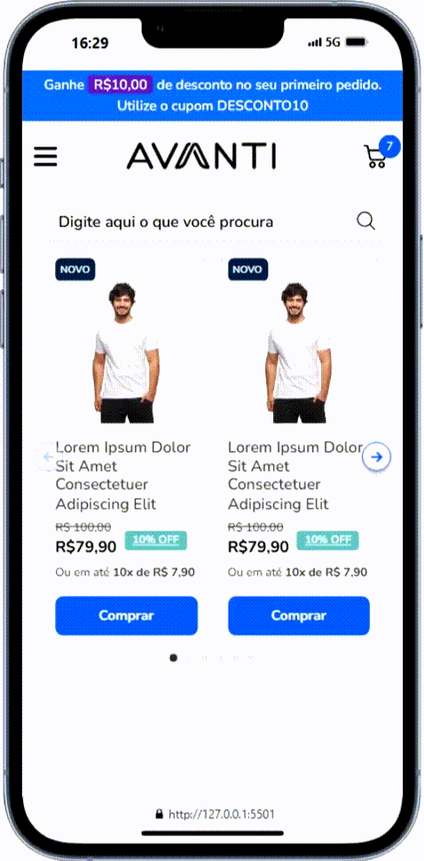
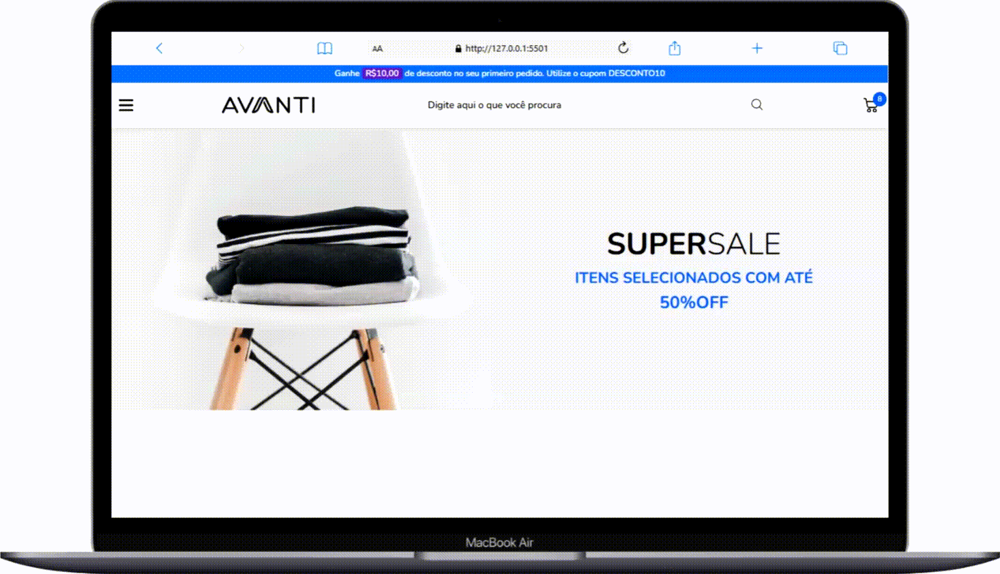
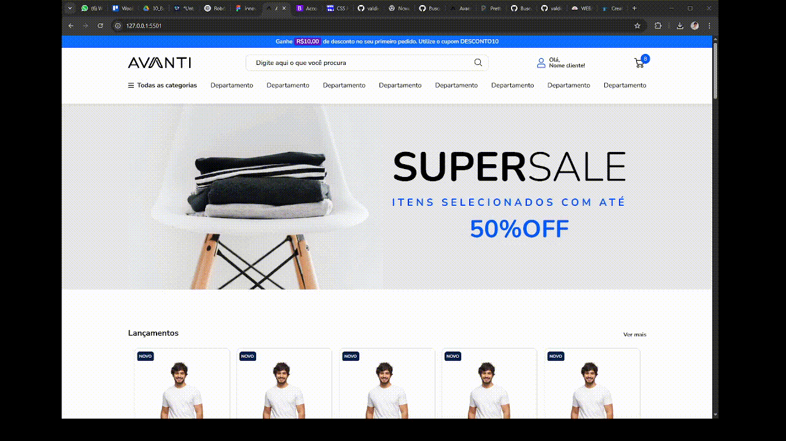

# E-commerce Avanti

## Tecnologias utilizadas:
- HTML
- CSS
- JavaScript
- Bootstrap

## Algumas melhorias adicionadas!

### Animações

Usando a biblioteca [AOS (Animate on Scroll)](https://michalsnik.github.io/aos/), adicionei algumas animações agradáveis, deixando a interface mais fluida.

### Adicionar ao carrinho (método)

Quando o usuário clica em "comprar", um toast é disparado e o indicador do carrinho aumenta em mais um no LocalStorage. Ao atualizar a página, esse indicador permanece com o mesmo número, e caso ele não seja definido, então é inicializado na página como 2, conforme o layout do Figma.

### Preloader

Por uma questão de estilo e performance, é exibida uma tela de carregamento para o usuário antes da página ser acessada.

### Validação do input de pesquisa

Quando o usuário tenta pesquisar algo no input da navbar (seja pressionando Enter ou na lupa), o site faz uma verificação se há texto e retorna uma mensagem de erro caso não haja.

### Navbar destkop

Em telas maiores, a navbar é projetada com o mouse over para exibir as categorias de acordo com seus respectivos departamentos. Quando o botão de departamento é clicado, a parte esquerda do menu é ocultada.

É isso! O layout mobile do Figma ficou um pouco confuso pra mim, por estar diferente do layout desktop em muitas partes... no geral, foi um desafio muito legal pra reforçar mais os conceitos de HTML, CSS e JS.